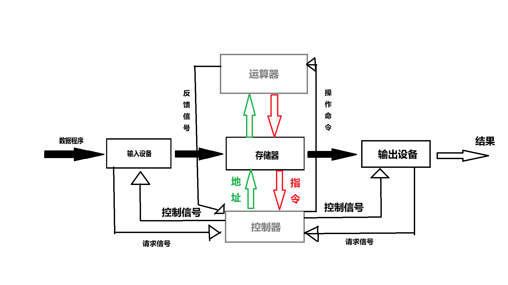

# 第一章：计算机基础知识

随着社会、科技、经济和文化的快速发展，特别是计算机技术和通信技术的结合，人们对信息的意识越来越强，对开发和使用信息资源的重视程度越来越高。如何学会操作计算机已经成为每一位职场人士在这个信息纷杂的社会中站稳脚跟的必备基本技能之一。 
本章旨在帮助学生认识到学习计算机的重要性，感受计算机功能的强大，掌握计算机最基本的知识，掌握计算机内部数据的表示与处理方式，理解计算机的工作过程，为今后学习奠定基础。

## 本章要点

- 计算机概述
- 计算机的工作原理与系统构成
- 计算机的硬件构成
- 信息在计算机中的表示与存储

## 学习目标

当今社会，计算机的应用已经相当普及。例如，很多人都用其玩过游戏，栩栩如生的游戏人物、逼真的游戏画面，不得不让人们感叹计算机功能的强大。 
实际上，计算机诞生的时间并不算长，如果从1946年最早的电子管计算机诞生算起，不到80年；如果从1990年诞生的个人计算机被广泛使用开始算起，仅仅不过30余年的时间。 
在如此短的时间内，计算机的发展如此迅猛，它到底是如何构造和运行的？它所具有的强大功能又是如何实现的？本章就通过计算机原理来揭开它的神秘面纱。

## 1.1 计算机概述

计算机是一个重要的应用工具，在它的帮助下，我们的生活发生了很大的变化。那么，计算机是如何给我们带来这些改变的呢？它都有哪些特点？它是如何分类和应用的？又是如何发展的？本节首先来了解这方面的知识。

### 1.1.1 计算机的特点

计算机主要有如下特点。

- 运算速度快：目前，巨型机的运算速度可达每秒千万亿次，而微机也可达每秒亿次以上，这使得大量复杂的科学技术问题得以解决。例如，卫星轨道的计算、24小时天气预报的计算等。过去人工计算需要几年，现在使用计算机只需几小时甚至是几分钟即可完成。
- 计算精确度高：科学技术的发展需要高度精确的计算。一般计算机可以有十几位甚至是几十位（二进制）有效数字，计算精度可由千分之几到百万分之几，是其他任何计算工具所不及的。
- 具有存储和逻辑判断能力：随着计算机存储容量的不断增大，可存储的信息越来越多。计算机不仅能进行计算，而且能把参加运算的数据、程序以及中间结果和最终结果保存起来，以供用户随时调用。计算机还可以通过编码技术对各种信息进行算术运算和逻辑运算，或是进行推理和证明。
- 具有自动控制能力：将各种运行步骤编译为程序并传递给计算机，计算机将会按照人们的操作来自动完成相应的工作。今期流行的 IoT（物联网）、智能家居、智能机器人以及 ChatGPT 都是计算机高度自动化的表现。

### 1.1.2 计算机的发展

下面将简要介绍计算机的发展历程。 
**第一代**（1946~1958）电子管计算机时代。其主要特征是采用电子管作为运算和逻辑元件，用计算机汇编语言编写程序。此时的计算机价格昂贵，主要用于军事、科学和工程计算。

> 1946年世界上第一台电子多用途计算机诞生于美国宾夕法尼亚大学，它被命名为**ENIAC**。此计算机使用了18,000多个电子管和1,500多个继电器，占地面积170㎡，重约30余吨，耗电140kW/h，但是其计算能力仅比现在的普通计算器稍强。

**第二代**（1959~1964）晶体管计算机时代。其主要特征是用晶体管代替电子管作为运算和逻辑元件，用磁带和磁盘作为外存储器，使用面向过程的程序设计语言编写程序。此时的计算机体积已大为缩小，从房间大小的第一代计算机缩小到衣柜大小。此时的计算机应用领域已拓展到商业数据处理和过程控制。

> 目前，大多数电子设备中的电子管都已被晶体管所取代，但由于电子管具有工作频率高和线性性能优良等特点，在一些胆机中仍然被使用。

**第三代**（1965~1970）集成电路计算机时代。其特征是用集成电路代替了分立元件，用半导体存储器取代了磁芯存储器，而在软件方面，操作系统日益成熟（DOS就是在此阶段诞生的）。这一时期，计算机的应用被拓展到信息管理（如会计电算化）、计算机辅助设计（CAD）、计算机辅助制造等领域。

> 第三代计算机的代表机型时IBM公司于1965年推出的System/360，其主要面向大型企业销售，售价在250万到300万美刀之间。

**第四代**（1971~至今）大规模和超大规模集成电路计算机时代。其特征是大规模集成电路和超大规模集成电路的广泛应用，而在软件方面，则经历了数据库系统、分布式操作系统等技术的发展。这一时期（特别是从20世纪80年代开始），计算机网络发展迅速，个人计算机开始走向千家万户。

> 第一个诞生的大规模集成电路，即中央处理器（CPU），是英特尔公司1971年发布的4004（4位），然后依次是Intel 8088（8位）、8086（16位）、80286、386（x86）、486、586（奔腾），接着是奔腾二、三、四代（x64）、酷睿处理器等。其中，80286计算机是我国20世纪80年代使用的个人计算机，早期售价在几十万元人民币，当时只在一些国家单位和学校中拥有并使用，它不具有图形界面，只能运行MS-DOS操作系统，其性能甚至还不如现今几百元价位的手机。

20世纪80年代~~日本~~（小日子过得还不错的国家）提出了第五代计算机的研制计划，并将第五代计算机称为智能计算机（即能够与人交互的计算机系统）。但是，到目前为止的智能计算机仍然具有很多缺陷（如不能联想、不能推理、不能学习等），无法做到与人无障碍地沟通和对话，所以目前我们使用的计算机仍然属于第四代计算机。

### 1.1.3 计算机的分类

计算机的分类方法是多种多样的，例如，按照用途可分为模拟和数字，按照应用范围可分为通用和专用等等。本节按照最普遍的分类方法，即按照计算机的综合性能指标来划分计算机的类型，具体分类如下所述。

- 巨型机：运算性能超强的将计算机（可以达到每秒千万亿次浮点运算）。巨型机价格昂贵，数量稀少，多用于航天、勘探、气象、金融等众多需要大数据运算的领域。
- 服务器：运算速度和稳定性强于个人计算机，但性能差于巨型计算机。它没有巨型机那么高的运算速度（有的甚至还不如某些个人计算机），但是由于其安全性高（性能稳定、数据不易丢失），可以长时间连续运行，多作为共享资源的中心节点，在Web服务、文件存储、数据库应用及通信等方面广泛应用。
- 工作站：工作站比个人计算机性能要高，但又不具有服务器那样的高稳定性。它主要面向专业应用领域，其强大的数据运算与图形图像处理能力，可以满足工业设计、动画制作、模拟仿真和金融管理等领域的需要。
- 微机：这是工作和生活中最常见的个人计算机（包括台式机、笔记本和平板电脑等）。微机的特点是价格便宜、兼容性和适应性好、操作方便简单，因此被广泛应用于办公、学习和娱乐等社会生活的方方面面。
- 嵌入式计算机：可以把它理解为嵌入到其他设备内的计算机，高级一些的（如现在的智能手机、智能电视等）都安装有内部操作系统。诸如安装在电冰箱、洗衣机、空调、电饭煲内部的控制电路板，也都属于嵌入式计算机的范畴。嵌入式计算机通常是为了满足智能控制的需要，所以有些只是一个控制电路（如“单片机开发”实际上就是要制造这种嵌入式的计算机）。

### 1.1.4 计算机的应用

万里之外可以与人通话，全球可以电视直播……计算机发展到今天，可以说是彻底颠覆和改变了人们的工作和生活。本节将介绍计算机的主要应用领域。

- 高效办公：现在无论是去银行还是各种营业厅，工作人员几乎都是人手一台计算机进行业务处理。计算机的高性能，配合各种各样的应用软件，再加上外围设备的支持，很多公司都实现了无纸化办公。所以说，在如今的工作生活中，掌握一定的计算机操作技能是非常有必要的。
- 娱乐：可以利用计算机听音乐、看电视、看电影、玩游戏等。现在的计算机游戏非常多，有单机游戏，也有多人游戏，还有网络游戏。
- 网络通信：利用计算机网络，可以非常方便地共享数据，可以快速及时地传送或查询信息（电子邮件取代了手写邮件），可以收发传真、拨打可视电话，可以在家中进行购物、求医甚至是找工作等。
- 信息管理：计算机在数据处理方面的高性能，令它在这一应用领域绝对不可缺少。各种各样的日常工作，例如人事管理、金融管理、仓储管理、客票预定、图书和资料检索等，都已离不开计算机。
- 平面、动画设计及排版：以前的动画片都是手绘的，操作繁琐、效率低下，现在在计算机的帮助下，可以大大缩短图像处理和动画制作的时间，而且有时可以以假乱真。使用计算机编排文章、处理文字、插入图片等操作都是非常简单和高效的。
- 辅助功能：使用计算机辅助设计（CAD）可以省去手绘图纸的麻烦，修改起来非常方便；计算机辅助制造（CAM）可以将设计意图快速转化成产品；计算机辅助工程（CAE）则可以实现在设计过程中模拟测试产品生产出来的性能。此外，还可以利用计算机进行计算机辅助教学（CAI）、计算机辅助翻译（CAT）等工作。
- 科学计算：这一领域是计算机最早的应用领域，当前也仍在广泛应用。例如，前面提及的天气预报、航空航天、勘探和金融等领域，都在大量应用计算机。
- 过程控制：在工业和军事等领域常利用计算机实时采集、监测数据，并根据预定方案进行自动控制。对于一些危险领域，使用计算机进行过程控制也是很有必要的。
- 人工智能：目前，岁然我们还不能制造真正意义上的机器人，但是各种智能手表、智能眼镜、智能手机、智能电视等设备不断涌现，也在日新月异地改变着我们的生活。随着科技的日益进步，相信这些目前还不太智能的智能设备必将变得越来越“聪明”。

## 1.2 计算机的工作原理与系统构成

为了更好地使用计算机，就必须对计算机系统有全面的了解。本节主要介绍计算机的基本工作原理、计算机软硬件系统、计算机指令、程序设计语言以及计算机的性能指标等基础知识。

### 1.2.1 计算机工作原理

在20世纪50年代，随着科学研究的深入，人们发现在验证一些数据或物理现象时，都需要进行复杂的运算。如果通过手工计算这些数据，所需花费的时间是令人无法容忍的，所以促使人们必须研制计算速度较快的自动计算装置。 
一开始，人们制造了一些简单的电子计算装置，但是它们有个缺点，那就是只能执行一种或几种计算功能（类似现在的计算器），缺少灵活性和普遍适用性。 
在1944~1945年间研制ENIAC计算机时，冯·诺依曼加入了研制小组，为了使电子计算器能够胜任各种计算任务，他提出了以“程序存储”和“程序控制”为主要思想的“冯·诺依曼体系结构”。 
“冯·诺依曼体系结构”中，不再把要执行的计算任务固化在计算机的CPU中，而是将其作为程序暂存到计算机的存储器中。在执行计算任务时，CPU从存储器中取出数据和指令，按便好的程序对存储器中的数据进行相关计算操作，并将计算结果返回到存储器，最后将计算结果输出到输出设备上。

> 电子计算机的问世，最终哟的奠基人是英国科学家艾兰·图灵和美籍匈牙利科学家约翰·冯·诺依曼。图灵的贡献是建立了图灵机的理论模型，奠定了人工智能的基础。冯·诺依曼则是首先提出了计算机体系结构的设想。 半个多世纪以来，计算机制造技术发生了巨大变化，“冯·诺依曼体系结构”仍然沿用至今，人们总是把冯·诺依曼称为“计算机鼻祖”。

“冯·诺依曼体系结构”中，将计算机规划为[五大功能部件](../附加/计算机系统.xmind)，即输入设备、存储器、控制器、运算器和输出设备，其工作过程分为四步。 
第一步：将程序和数据通过输入设备送入存储器。 
第二部：输入完毕后，单击“=”按钮开始计算，计算机从存储器中取出程序指令（这里为“+”），送到控制器去识别，分析该指令所要做的事情。

第三步：控制器根据指令的含义发出相应的操作命令，将存储器中粗放的操作数据一同取出（输入的俩1）并送往运算器进行运算，最后把运算结果送回存储器指定的单元中。 
第四步：完成运算任务后，控制器再将计算结果取出，显示到输出设备上，就可以看到计算结果了。

> 计算机实际上就是从开始计算1+1这样简单的数学计算开始，再到减法、乘法、除法等运算，然后慢慢发展起来的。 就像燕子筑巢一样，而且更加繁琐。最终实现了这样庞大而精彩绝伦的工程，不得不感叹，这是运用全人类的智慧创造的伟大奇迹。

### 1.2.2 计算机硬件系统

*电脑老手总是告诫新手一句话：能用锤子砸到的东西，是硬件；只能瞪着眼干骂的东西，是软件。*

计算机硬件是指有形的物理设备，是看得见、摸得着的。按照上街介绍的“冯·诺依曼体系结构”，计算机的硬件可归类为输入设备、输出设备、存储器、运算器和控制器五大类设备。 
在现代计算机中，输入设备主要是指键盘和鼠标；输出设备主要为显示器、打印机 、音箱等；存储器主要包括内存、硬盘、U盘等；运算器和控制器则主要是CPU。实际上，显卡、声卡等都有单独的运算和控制单元。  
此外，计算机体系还包括下面将要讲到的软件系统。软件是指在硬件上运行的程序和相关的数据及文档等。软件平时存储在硬盘上，在机器运行时才会读入内存，然后按照输入的指令指挥计算机去开展工作。 
硬件和软件共同构成了整个计算机系统，详情[请参阅此处](../附加/计算机系统.xmind)。